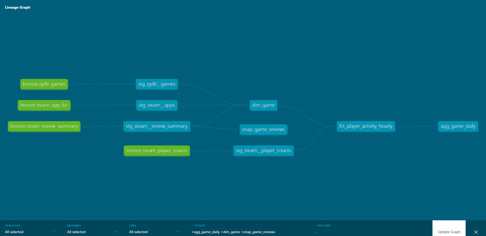
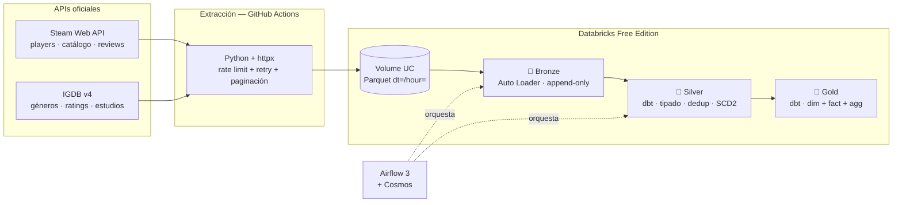

# 🎮 Steam Lakehouse — Pipeline analítico de actividad de videojuegos

Pipeline de datos **end-to-end** que ingesta la actividad de jugadores de Steam cada hora, la procesa con una arquitectura **medallion** sobre Databricks y la expone lista para analítica. Construido íntegramente con **cuentas gratuitas** y **APIs oficiales**.


<!-- Reemplaza esta imagen por tu screenshot del grafo de linaje de dbt docs -->

---

## 📌 Resumen

| | |
|---|---|
| **Fuentes** | Steam Web API (Valve) · IGDB v4 (Twitch/Amazon) |
| **Ingesta** | Python (httpx + tenacity) · GitHub Actions (cron horario) |
| **Lakehouse** | Databricks Free Edition · Delta Lake · Unity Catalog · Auto Loader |
| **Transformación** | dbt Core + dbt-databricks (medallion bronze → silver → gold) |
| **Calidad** | 29 tests de dbt · dbt-expectations · source freshness · Elementary |
| **Orquestación** | Apache Airflow 3 (DAG con Cosmos) |
| **Costo total** | **US$ 0** |

---

## 🎯 Por qué este proyecto

La mayoría de los proyectos de portafolio cargan un CSV de Kaggle una sola vez. Eso no demuestra ingeniería de datos: demuestra que sabes leer un archivo.

Aquí el dato **cambia cada hora y no existe en ningún otro lado**. Nadie guarda el histórico de jugadores concurrentes de Steam — la API solo te dice cuántos hay *ahora*. Eso obliga a resolver los problemas reales del oficio:

- Ingesta incremental idempotente (una corrida repetida no duplica filas)
- Manejo de *rate limits*, reintentos y *backoff* exponencial
- Paginación de APIs con grandes volúmenes
- Llegadas tardías y reprocesos con ventana de *lookback*
- SCD tipo 2 para historizar atributos que la fuente sobrescribe
- Detección de huecos de ingesta antes de que el negocio los vea

---

## 🏗️ Arquitectura



**Decisión de diseño clave:** la extracción corre en GitHub Actions, *fuera* de Databricks. Free Edition restringe el tráfico saliente a un conjunto limitado de dominios de confianza, así que un notebook no puede llamar a `api.steampowered.com`. Separar extracción de procesamiento es además la práctica correcta: el cómputo no debe esperar a que responda una API externa.

---

## 📊 Modelo de datos (capa gold)

Esquema en estrella:

```
dim_game (1 fila por juego)
    ├── appid, game_name, release_date
    ├── genres[], developers[], publishers[]
    └── igdb_rating, positive_ratio, review_score_desc

fct_player_activity_hourly (1 fila por juego × hora)  ← tabla de hechos
    ├── game_key → dim_game
    ├── player_count, player_delta_hour
    └── player_count_ma_24h, player_growth_pct_hour

agg_game_daily (1 fila por juego × día)  ← resumen listo para BI
    └── peak_players, avg_players, peak_hour_utc, hours_observed

snap_game_reviews (SCD2)  ← historial de reputación
    └── "¿cuándo pasó este juego de Mixed a Mostly Positive?"
```

El grafo de linaje completo (bronze → silver → gold) se genera automáticamente con `dbt docs`.

---

## 🔥 Problemas resueltos

> Esta sección es la más importante del proyecto. Cada uno de estos problemas apareció durante la construcción real y refleja el trabajo cotidiano de un ingeniero de datos: mantener un pipeline vivo frente a fuentes y herramientas que cambian sin avisar.

### 1. Valve deprecó el endpoint del catálogo → migración con paginación
El endpoint `ISteamApps/GetAppList/v2` devolvía **404**: Valve lo deprecó porque ya no escala al volumen de apps de Steam. Diagnostiqué el 404 leyendo la documentación de Steamworks y migré a `IStoreService/GetAppList/v1`, que requiere API key y **pagina** los resultados. Implementé el patrón de paginación con puntero `last_appid`, trayendo el catálogo completo (**176.215 apps**) en páginas de 50.000.

### 2. IGDB deprecó el campo `category` → diagnóstico sobre datos crudos
La consulta a IGDB devolvía siempre lista vacía pese a responder `200 OK`. El filtro `where category = 1` (Steam) ya no funcionaba. En vez de adivinar, consulté un registro conocido con `fields *` y descubrí que **los juegos de Steam traen `category = null`**: IGDB migró al campo `external_game_source`, donde Steam es `= 1`. Ajusté el filtro y la ingesta funcionó.

### 3. Auto Loader reportaba OK con la tabla vacía → `awaitTermination`
Bronze marcaba `OK` pero la tabla de IGDB quedaba en **0 filas**, aunque el Parquet en el Volume tenía 18 registros. El problema era de *timing*: con `trigger(availableNow=True)`, el código seguía de largo antes de que el stream terminara de escribir. La solución fue capturar el query y llamar a `awaitTermination()` para esperar a que la escritura concluyera antes de continuar.

### 4. Conflicto de dependencias entre el SDK de Databricks y dbt
`pip install` fallaba con `ResolutionImpossible`: yo fijaba `databricks-sdk==0.40.0` pero `dbt-databricks` exigía `0.17.0`. Relajé la restricción a `databricks-sdk>=0.17.0` y dejé que el resolutor de pip encontrara una versión compatible.

### 5. Python demasiado nuevo para el ecosistema de datos
Con Python 3.14, `pandas` y `pyarrow` intentaban **compilarse desde código fuente** (no había *wheels* precompilados) y fallaban por falta del compilador de C++ en Windows. Recreé el entorno con **Python 3.11** (estable y ampliamente soportado), y todo instaló precompilado. Lección: para trabajo de datos, no uses la última versión de Python.

### 6. Principio de mínimo privilegio en los tokens
La subida al Volume fallaba con `token does not have required scopes: files`. El token se había creado con alcance "Herramientas de BI", que permite consultar el warehouse pero no escribir archivos. Regeneré el token con el scope `files` — un ejemplo práctico de ajustar permisos a lo estrictamente necesario.

### 7. Git Bash corrompía el `http_path` de dbt
`dbt debug` mostraba `http_path: C:/Program Files/Git/sql/1.0/...`: Git Bash en Windows "traduce" las rutas que empiezan con `/` agregándoles su directorio de instalación. Lo resolví fijando el `http_path` directamente en `profiles.yml` en vez de leerlo de la variable de entorno.

---

## 🚀 Reproducir el proyecto

### Prerrequisitos
- **Python 3.11** (no 3.14 — ver problema #5)
- Cuenta de **Databricks Free Edition**
- App en la **Twitch Developer Console** (para IGDB)
- **Steam Web API key** (`steamcommunity.com/dev/apikey`)

### 1. Clonar y preparar el entorno
```bash
git clone https://github.com/jhordan64/steam-lakehouse.git
cd steam-lakehouse
py -3.11 -m venv .venv
source .venv/Scripts/activate     # Windows: .venv\Scripts\activate
pip install -r requirements.txt
cp .env.example .env               # rellenar con tus credenciales
```

### 2. Crear catálogo y esquemas en Databricks
```sql
CREATE CATALOG IF NOT EXISTS steam_lakehouse;
CREATE SCHEMA  IF NOT EXISTS steam_lakehouse.landing;
CREATE SCHEMA  IF NOT EXISTS steam_lakehouse.bronze;
CREATE SCHEMA  IF NOT EXISTS steam_lakehouse.silver;
CREATE SCHEMA  IF NOT EXISTS steam_lakehouse.gold;
CREATE VOLUME  IF NOT EXISTS steam_lakehouse.landing.raw;
```

### 3. Ingestar las fuentes
```bash
python -m ingestion.run_ingest app_list       # catálogo (paginado)
python -m ingestion.run_ingest player_counts   # jugadores concurrentes
python -m ingestion.run_ingest reviews         # resumen de reseñas
python -m ingestion.run_ingest igdb_games      # metadata de IGDB
```

### 4. Bronze — Auto Loader
Sube y ejecuta `databricks/notebooks/01_bronze_autoloader.py` en Databricks. Materializa el Parquet del Volume en tablas Delta bronze de forma incremental.

### 5. Silver + Gold con dbt
```bash
cd dbt
cp profiles.yml.example profiles.yml
export DBT_PROFILES_DIR=.
dbt deps
dbt debug        # verifica la conexión
dbt build        # modelos + tests
dbt docs generate --select "steam_lakehouse.*" && dbt docs serve
```

### 6. Automatización
Los workflows de `.github/workflows/` corren la ingesta cada hora (`ingest.yml`) y validan el código en cada push (`ci.yml`). Requieren estos secrets en el repo: `DATABRICKS_HOST`, `DATABRICKS_TOKEN`, `DATABRICKS_HTTP_PATH`, `IGDB_CLIENT_ID`, `IGDB_CLIENT_SECRET`, `STEAM_API_KEY`.

---

## 🧠 Decisiones de diseño

| Decisión | Motivo |
|---|---|
| Extracción fuera de Databricks | Free Edition restringe el egreso de red; además desacopla la latencia de la API del costo de cómputo. |
| Parquet particionado `dt=/hour=` | Permite *partition pruning* y reprocesar un día puntual sin tocar el resto. |
| Bronze append-only, sin transformar | Si aparece un bug en silver, se reconstruye todo desde bronze sin volver a llamar a la API. El histórico horario es irrecuperable. |
| `incremental_strategy='merge'` | Idempotencia: una corrida repetida actualiza, no duplica. |
| Ventana de *lookback* de 48h | Cubre reintentos y llegadas tardías sin el costo de un *full-refresh*. |
| Snapshot SCD2 en reseñas | La API sobrescribe el valor actual; sin snapshot, la historia se pierde. |
| Watchlist curada (~20 juegos) | Pedir 176k appids por hora sería abusivo. La lista se puede recalcular desde gold. |
| Test de `hours_observed` | Un pipeline en verde con huecos de datos es peor que uno en rojo: nadie se entera. |

---

## ⚙️ Límites de las APIs

| Fuente | Límite | Cómo se respeta |
|---|---|---|
| Steam Web API | Sin límite publicado; Valve aplica *shadow-bans* al tráfico agresivo | 1 req/s, User-Agent identificable, *backoff* exponencial |
| Steam Store (reviews) | ~200 req / 5 min | Solo `query_summary`, una vez al día |
| IGDB v4 | 4 req/s | Limitado a 3 req/s, lotes de 50 appids |

Uso no comercial en ambos casos.

---

## 🗺️ Roadmap

- [ ] Dashboard en Power BI (top juegos, tendencias horarias, ratings)
- [ ] Airflow orquestando Bronze + dbt de punta a punta
- [ ] Databricks Asset Bundles para desplegar jobs como código
- [ ] Detección de anomalías sobre `player_delta_hour`
- [ ] Análisis de sentimiento sobre el texto de reseñas

---

## 📄 Licencia

MIT. Datos de Steam © Valve Corporation. Datos de IGDB © IGDB.com.
