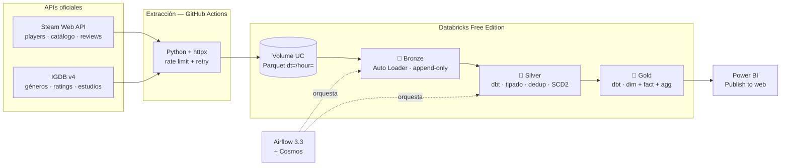

# Steam Lakehouse — pipeline analítico de actividad de videojuegos

Pipeline de datos end-to-end que ingesta **jugadores concurrentes de Steam cada hora**, los procesa en una arquitectura medallion sobre Databricks y los expone en un dashboard de Power BI.

Todo el stack corre con **cuentas gratuitas**. Todas las fuentes son **APIs oficiales**.

| | |
|---|---|
| **Fuentes** | Steam Web API (Valve) · IGDB v4 (Twitch/Amazon) |
| **Orquestación** | Apache Airflow 3.3 + GitHub Actions |
| **Lakehouse** | Databricks Free Edition · Delta Lake · Unity Catalog |
| **Transformación** | dbt Core + dbt-databricks |
| **BI** | Power BI |
| **Calidad** | dbt tests · dbt-expectations · source freshness |

---

## Por qué este proyecto

La mayoría de los proyectos de portafolio cargan un CSV de Kaggle una sola vez. Eso no demuestra ingeniería de datos: demuestra que sabes leer un archivo.

Aquí el dato **cambia cada hora y no existe en ningún otro lado**. Nadie guarda el histórico de jugadores concurrentes de Steam — la API solo te dice cuántos hay *ahora*. Eso obliga a resolver los problemas reales del oficio:

- Carga incremental idempotente (una corrida repetida no duplica filas)
- Manejo de rate limits, reintentos y backoff exponencial
- Llegadas tardías y reprocesos con ventana de *lookback*
- SCD tipo 2 para historizar atributos que la fuente sobrescribe
- Detección de huecos de ingesta antes de que el negocio los vea

---

## Arquitectura



**La decisión no obvia:** la extracción corre en GitHub Actions, no dentro de Databricks. Free Edition restringe el tráfico saliente a un set limitado de dominios de confianza, así que un notebook no puede llamar a `api.steampowered.com`. Separar extracción de procesamiento es además la práctica correcta: el cluster no debería esperar a que responda una API externa.

---

## Modelo de datos (capa gold)

Esquema en estrella:

```
dim_game (1 fila por juego)
    ├── appid, game_name, release_date
    ├── genres[], developers[], publishers[]
    └── igdb_rating, positive_ratio

fct_player_activity_hourly (1 fila por juego × hora)  ← tabla de hechos
    ├── game_key → dim_game
    ├── player_count, player_delta_hour
    └── player_count_ma_24h, player_growth_pct_hour

agg_game_daily (1 fila por juego × día)  ← lo que consume Power BI
    └── peak_players, avg_players, peak_hour_utc, hours_observed

snap_game_reviews (SCD2)  ← historial de reputación
    └── "¿cuándo pasó este juego de Mixed a Mostly Positive?"
```

---

## Paso a paso

### 0. Prerrequisitos

- Python 3.11+
- Git y una cuenta de GitHub
- Docker Desktop (solo para Airflow local)
- Power BI Desktop (Windows, gratis)

```bash
git clone https://github.com/TU_USUARIO/steam-lakehouse.git
cd steam-lakehouse
python -m venv .venv && source .venv/bin/activate   # Windows: .venv\Scripts\activate
pip install -r requirements.txt
cp .env.example .env
```

### 1. Crear la cuenta de Databricks Free Edition

1. Entra a `login.databricks.com` y regístrate en **Free Edition** (no el trial: el trial consume tu cuenta cloud).
2. **Verifica tu identidad con LinkedIn** desde la configuración de la cuenta. Desbloquea acceso a internet saliente y límites más altos. Es opcional para este diseño, pero te da margen.
3. Genera un **Personal Access Token**: avatar → *Settings* → *Developer* → *Access Tokens* → *Generate new token*. Guárdalo, no se muestra dos veces.
4. Copia los datos del SQL warehouse: menú *SQL Warehouses* → **Serverless Starter Warehouse** → pestaña *Connection details*. Necesitas `Server hostname` y `HTTP path`.

> Free Edition no te deja crear un warehouse nuevo, pero el preexistente (2X-Small) sobra para este volumen.

Pega todo en tu `.env`.

### 2. Crear catálogo, esquemas y volume

En un notebook de Databricks:

```sql
CREATE CATALOG IF NOT EXISTS steam_lakehouse;
CREATE SCHEMA  IF NOT EXISTS steam_lakehouse.landing;
CREATE SCHEMA  IF NOT EXISTS steam_lakehouse.bronze;
CREATE SCHEMA  IF NOT EXISTS steam_lakehouse.silver;
CREATE SCHEMA  IF NOT EXISTS steam_lakehouse.gold;
CREATE VOLUME  IF NOT EXISTS steam_lakehouse.landing.raw;
```

### 3. Credenciales de IGDB

1. Crea una app en la **Twitch Developer Console** (`dev.twitch.tv/console`).
2. *OAuth Redirect URL*: `http://localhost`. *Client Type*: **Confidential** (necesario para obtener el secret).
3. Copia `Client ID` y `Client Secret` a tu `.env`.

Steam no requiere API key para los endpoints que usamos.

### 4. Primera ingesta manual

```bash
python -m ingestion.run_ingest app_list
python -m ingestion.run_ingest player_counts
python -m ingestion.run_ingest igdb_games
```

Verifica en Databricks que aparecieron los Parquet:

```sql
LIST '/Volumes/steam_lakehouse/landing/raw/steam_player_counts';
```

### 5. Bronze con Auto Loader

Sube `databricks/notebooks/01_bronze_autoloader.py` al workspace y ejecútalo. Auto Loader lleva un checkpoint: la segunda corrida solo procesa archivos nuevos.

### 6. Silver y gold con dbt

```bash
cd dbt
cp profiles.yml.example profiles.yml
export DBT_PROFILES_DIR=.
dbt deps
dbt debug          # valida la conexión antes de nada
dbt build          # ejecuta modelos + tests
dbt snapshot
```

`dbt build` corre modelos y tests juntos: si un test falla, los modelos que dependen de él no se construyen. Esa es la diferencia entre un pipeline y un script.

### 7. Automatizar la ingesta

En tu repo de GitHub → *Settings* → *Secrets and variables* → *Actions*:

| Tipo | Nombre |
|---|---|
| Secret | `DATABRICKS_HOST`, `DATABRICKS_TOKEN`, `DATABRICKS_HTTP_PATH` |
| Secret | `IGDB_CLIENT_ID`, `IGDB_CLIENT_SECRET` |
| Variable | `DATABRICKS_CATALOG`, `INGEST_USER_AGENT` |

**El repo debe ser público** para tener minutos ilimitados de Actions (y para que sirva de portafolio). Nunca commitees el `.env`.

> ⚠️ GitHub desactiva los workflows programados de un repo público si pasa 60 días sin actividad. Un commit al mes lo evita.

### 8. Airflow local

```bash
cd airflow
astro dev start          # o docker compose up con la imagen apache/airflow:3.3.0
```

Crea la conexión `databricks_default` en la UI (*Admin → Connections*) con tu host y token. El DAG usa **Cosmos**, que renderiza cada modelo dbt como una task independiente — el grafo resultante es el mejor screenshot del proyecto.

### 9. Power BI

1. *Obtener datos* → **Databricks** → pega hostname y HTTP path → autentica con el PAT.
2. Selecciona `gold.agg_game_daily` y `gold.dim_game` en **modo Import** (no DirectQuery: el warehouse gratis se apaga por inactividad).
3. Construye el modelo: relación `dim_game[game_key] → agg_game_daily[game_key]`, y una tabla de calendario.
4. Publica y luego *Archivo → Insertar informe → **Publicar en la web***. Obtienes una URL pública para tu LinkedIn.

> La licencia gratuita no permite compartir informes directamente, pero *Publicar en la web* genera un enlace público sin requisito de licencia. Solo úsalo con datos públicos como estos.

### 10. Publicar la documentación

`dbt docs generate --static` produce un HTML con el grafo de linaje completo. El workflow de CI ya lo despliega a GitHub Pages en cada push a `main`. Ese link va en el README y en tu perfil.

---

## Decisiones de diseño

| Decisión | Por qué |
|---|---|
| Extracción fuera de Databricks | Free Edition restringe el egreso de red; además desacopla la latencia de la API del costo de cómputo. |
| Parquet particionado `dt=/hour=` | Permite *partition pruning* y reprocesar un día puntual sin tocar el resto. |
| Bronze append-only sin transformar | Si mañana encuentro un bug en silver, puedo reconstruir todo desde bronze sin volver a llamar a la API. El histórico horario es irrecuperable. |
| `incremental_strategy='merge'` | Idempotencia: una corrida repetida actualiza, no duplica. |
| Ventana de *lookback* de 48h | Cubre reintentos y llegadas tardías sin el costo de un `full-refresh`. |
| Snapshot SCD2 en reseñas | La API sobrescribe el valor actual. Sin snapshot, la historia se pierde para siempre. |
| Watchlist curada de ~20 juegos | Pedir 200.000 appids por hora sería abusivo e innecesario. La lista se puede recalcular desde gold. |
| Test de `hours_observed` | Un pipeline en verde con huecos de datos es peor que uno en rojo: nadie se entera. |

---

## Límites de las APIs

| Fuente | Límite | Cómo lo respetamos |
|---|---|---|
| Steam Web API | Sin límite publicado; Valve aplica shadow-bans al tráfico agresivo | 1 req/s, User-Agent identificable, backoff exponencial |
| Steam Store (reviews) | ~200 req / 5 min | Solo `query_summary`, una vez al día |
| IGDB v4 | 4 req/s, máx. 8 conexiones abiertas | Limitado a 3 req/s, lotes de 50 appids |

Uso no comercial en ambos casos. IGDB es gratis bajo el Twitch Developer Service Agreement.

---

## Roadmap

- [ ] Elementary para reportes de observabilidad de datos
- [ ] Databricks Asset Bundles (`databricks.yml`) para desplegar jobs como código
- [ ] Detección de anomalías sobre `player_delta_hour`
- [ ] Ingesta del texto de reseñas + análisis de sentimiento
- [ ] Correlación entre lanzamientos/descuentos y picos de jugadores

---

## Licencia

MIT. Datos de Steam © Valve Corporation. Datos de IGDB © IGDB.com.
